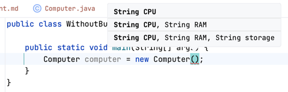

빌더 패턴은 복잡한 객체를 생성할 때 사용되며, 객체 생성에 필요한 인자와 선택적 인자를 명확하게 구분할 수 있다. 간단한 `Computer` 클래스를 만들고 빌더 패턴을 직접 구현하여 빌더 패턴이 가지는 장점을 직접 살펴보자. 

## 빌더 패턴 없는 기본 클래스

우선 빌더 패턴 없이 구현한 `Computer` 클래스를 작성한다.

```java
public class Computer {

    private String CPU;
    private String RAM;
    private String storage;

    public Computer(String CPU) {
        this.CPU = CPU;
    }

    public Computer(String CPU, String RAM) {
        this.CPU = CPU;
        this.RAM = RAM;
    }

    public Computer(String CPU, String RAM, String storage) {
        this.CPU = CPU;
        this.RAM = RAM;
        this.storage = storage;
    }
}
```

위와 같이 인자가 늘어날 때마다 생성자를 새롭게 작성해야 한다. 
또한 객체를 생성하기 위해 인자를 작성하는 경우 어떤 인자를 순서대로 넣어줘야 하는지 
IDE의 도움 없이는 확인하는 것이 매우 번거로우며 사람인지라 실수할 가능성도 존재한다.



## 빌더 패턴 구현

Java 개발자들이 많이 사용하는 Lombok의 `@Builder` 어노테이션의 기능과 유사하게 구현할 것이다.

### Lombok의 `@Builder ` 어노테이션

가장 먼저 Lombok의 `@Builder` 어노테이션 활용 시 어떤 식으로 객체를 생성할 수 있는지 살펴보자.

```java
@Getter
@NoArgsConstructor
@Table(name = "regions")
@Entity
public class Region {

    @Id @GeneratedValue(strategy = GenerationType.IDENTITY)
    private Long id;

    @Column(nullable = false, length = 50)
    private String name;

    @Builder
    public Region(Long id, String name) {
        this.id = id;
        this.name = name;
    }
}
```

```java
Region seoul = Region.builder()
        .name("Seoul")
        .build();

Region busan = Region.builder()
        .id(1L)
        .name("Busan")
        .build();
```

위와 같이 Lombok의 `@Builder` 어노테이션을 활용하여 빌더 패턴을 사용하면 
필드 이름과 함께 메소드 체이닝을 할 수 있어 가독성 높은 코드를 작성할 수 있다.
이를 통해 개발자 본인이 객체 생성을 위한 인자로 어떤 것을 사용하고 있는지 정확히 알 수 있다.

### 빌더 패턴 직접 구현

```java
public class Computer {

    private String CPU;
    private String RAM;
    private String storage;

    public static Builder builder() {
        return new Builder();
    }

    public static class Builder {

    }
}
```

우선 위와 같이 기본적인 틀을 작성한다. Computer 클래스의 static 메소드 `builder`는 객체를 생성할 정적 중첩 클래스인 `Builder`를 반환한다.

> 이때 `Builder` 클래스를 꼭 static으로 설정해야 한다. 
> 
> Lombok의 `@Builder` 어노테이션에서는 기본적으로 
> `builder` 메소드가 정적 메소드이다. 그렇다는 것은 `builder` 메소드가 반환하는 
> `Builder` 클래스는 절대 외부 클래스, 즉 `Computer` 클래스의 인스턴스에 의존해서는 안 된다.

이제 `builder` 메소드가 반환하는 `Builder` 클래스에 메소드 체이닝으로 객체를 생성해낼 수 있도록 여러 메소드를 추가하자.

```java
public class Computer {

    private String CPU;
    private String RAM;
    private String storage;

    private Computer(Builder builder) {
        this.CPU = builder.CPU;
        this.RAM = builder.RAM;
        this.storage = builder.storage;
    }

    public static Builder builder() {
        return new Builder();
    }

    public static class Builder {
        private String CPU;
        private String RAM;
        private String storage;

        public Builder withCPU(String CPU) {
            this.CPU = CPU;
            return this;
        }

        public Builder withRAM(String RAM) {
            this.RAM = RAM;
            return this;
        }

        public Builder withStorage(String storage) {
            this.storage = storage;
            return this;
        }

        public Computer build() {
            return new Computer(this);
        }
    }
}
```

이제 Lombok의 `@Builder` 어노테이션을 활용한 것처럼 객체를 생성해 낼 수 있다.

```java
public class Builder {

    public static void main(String[] args) {
        Computer computer = Computer.builder()
                .withCPU("Intel")
                .withRAM("32GB")
                .withStorage("2TB SSD")
                .build();
    }
}
```
