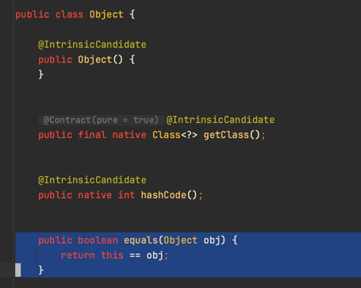

## Java의 동일성과 동등성

### 동일성

Java는 `==`으로 두 객체가 동일한 객체인지(객체의 메모리 주소가 같은지) 비교한다.

```java
public class Person {

    private String name;
    private int age;

    public Person(String name, int age) {
        this.name = name;
        this.age = age;
    }
}
```

```java
public class Main {

    public static void main(String[] args) {
        Person john1 = new Person("John", 30);
        Person john2 = new Person("John", 30);

        System.out.println(john1 == john2); // false 출력
    }
}
```

예를 들어 위와 같이 `john1`과 `john2` 모두 같은 이름과 나이를 갖고 있지만 `==`를 통한 동일성 비교에서는 객체의 메모리 주소를 비교하기 때문에 `false`가 출력된다.

### 동등성

하지만 만약 이름과 나이가 같은 경우 같은 객체라고 봐야하는 상황이 있다고 가정하자. 그렇다면 여러 객체가 이름과 나이가 같은지를 비교하고 같다면 `true`를 출력해야 할 것이다.

Java에서는 위의 상황처럼 이름과 나이가 같은, 즉 내용이 같다면 논리적으로 같은 객체라고 판단하려고 할 때 `equals` 메소드를 사용한다.
`equals` 메소드는 `Object` 클래스의 메소드이며 Java에서 모든 클래스는 명시적으로 다른 클래스를 상속하지 않더라도 기본적으로 `Object` 클래스를 상속하기 때문에 이 `equals` 메소드를 사용할 수 있다.
다만 `Object`의 `equals` 메소드는 `==`으로 동일성 비교를 하기 때문에 내용을 비교하여 논리적으로 같은지 판단하려면 오버라이딩이 필요하다.



따라서 동등성 비교를 위해 IntelliJ의 도움으로 간편하게 equals 메소드를 오버라이딩하여 사용하자.

```java
public class Person {

    private String name;
    private int age;

    public Person(String name, int age) {
        this.name = name;
        this.age = age;
    }

    @Override
    public boolean equals(Object o) {
        if (this == o) return true;
        if (!(o instanceof Person)) return false;
        Person person = (Person) o;
        return age == person.age && Objects.equals(name, person.name);
    }

    @Override
    public int hashCode() {
        return Objects.hash(name, age);
    }
}
```

> 오버라이딩한 `equals` 메소드를 자세히 살펴보면 `if (!(o instanceof Person)) return false;` 라고 작성된 코드를 볼 수 있다.
> 이는 `Person` 클래스의 인스턴스가 아니면 `false`를 리턴한다는 것을 의미한다. 하지만 `instanceof` 연산자는 특정 클래스 또는 그 하위 
> 클래스의 인스턴스인지 확인하기 때문에 하위 클래스의 객체가 상위 클래스로 형변환되어 들어온 경우에도 `true`를 반환한다.
> 
> 따라서 클래스까지 정확하게 비교해야 하는 상황이라면 `getClass` 메소드를 사용하자.