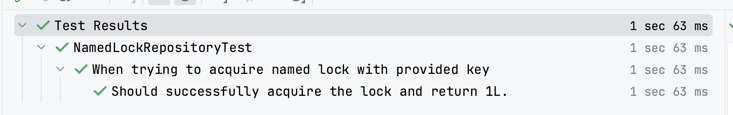
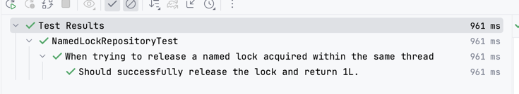
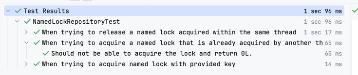

## 네임드 락(Named lock)이란?

네임드 락은 특정 문자열에 대한 잠금을 획득하여 다른 세션에서는 해당 문자열에 대한 잠금을 획득할 수 없게 하여 접근을 막는 방법이다.
특정 문자열에 대한 잠금을 획득한다고 해서 레코드를 잠그는 것이 아니기 때문에 애플리케이션에서 직접 로직을 작성하여 잠금 획득 및 레코드 접근을 묶어줄 필요가 있다.

## 잠금을 위한 Repository 생성

```java
@RequiredArgsConstructor
@Repository
public class NamedLockRepositoryImpl implements NamedLockRepository {

  private final EntityManager em;
}
```

JPA 기반의 레포지토리는 보통 엔티티와 함께 작성되기 때문에 엔티티와는 연관이 없는 잠금만을 위한 레포지토리를 따로 생성해야 한다.

네임드 락을 위한 레포지토리를 생성했다면 레포지토리 구현체에 이제 락 획득과 해제를 위한 메소드를 다음과 같이 추가하자.

```java
@RequiredArgsConstructor
@Repository
public class NamedLockRepositoryImpl implements NamedLockRepository {

    private final EntityManager em;

    @Override
    public Long acquireLock(String key, int timeout) {
        return (Long) em.createNativeQuery("SELECT GET_LOCK(:key, :timeout)")
                .setParameter("key", key)
                .setParameter("timeout", timeout)
                .getSingleResult();
    }

    @Override
    public Long releaseLock(String key) {
        return (Long) em.createNativeQuery("SELECT RELEASE_LOCK(:key)")
                .setParameter("key", key)
                .getSingleResult();
    }
}
```

`락 획득(acquireLock)`을 하기 위해 MySQL에서는 `SELECT GET_LOCK(key, timeout)`와 같이 작성한다.

포스팅 처음에 언급한 것처럼 네임드 락이란 레코드에 대한 잠금을 획득하는 것이 아니라 특정 문자열에 대한 잠금을 획득하는 방식이다.
따라서 어떤 문자열에 대한 잠금을 획득할 것인지 작성해야 한다. 또한 해당 세션에서 잠금 획득을 위한 `timeout`을 설정할 수도 있다.
만약 `0`으로 설정하게 되면 잠금 획득 실패 시 곧바로 실패에 대한 값을 반환한다.

잠금 해제의 경우 `timeout`이 필요없으니 `SELECT RELEASE_LOCK(key)`와 같이 특정 문자열만 입력하는 식으로 작성한다.

## 간단한 상황에 대한 테스트

레포지토리를 구현했으니 올바르게 동작했으니 테스트 코드를 작성해보자. 처음에는 우선 간단하게 락 경쟁이 없는 상황에서의 테스트를 작성할 것이다.

### 주어진 문자열로 락을 획득할 수 있다.

```java
@Nested
@DisplayName("When trying to acquire named lock with provided key")
class WhenTryingToAcquireNamedLockWithProvidedKey {

    @Test
    @DisplayName("Should successfully acquire the lock and return 1L.")
    public void shouldSuccessfullyAcquireTheLock_AndReturn1L() throws Exception {
        // given
        String lockKey = "lock_key";
        int timeout = 1;
    
        // when
        Long result = namedLockRepository.acquireLock(lockKey, timeout);
    
        // then
        assertThat(result).isEqualTo(1L);
    
        // release the acquired lock
        namedLockRepository.releaseLock(lockKey);
    }
}
```

MySQL에서 `SELECT GET_LOCK(key, timeout)`으로 락을 성공적으로 획득한다면 숫자 1을 반환한다.
현재 테스트에서는 어떤 스레드에서도 `lock_key` 문자열에 대한 잠금을 획득한 적이 없기 때문에 성공적으로 해당 문자열에 대한 잠금을 획득할 수 있다.



### 주어진 문자열로 이미 획득한 락을 해제할 수 있다.

```java
    @Nested
    @DisplayName("When trying to release a named lock acquired within the same thread")
    class WhenTryingToReleaseNamedLockAcquiredWithinTheSameThread {

        @Test
        @DisplayName("Should successfully release the lock and return 1L.")
        public void shouldSuccessfullyReleaseTheLock_AndReturn1L() throws Exception {
            // given
            String lockKey = "lock_key";
            int timeout = 0;
            namedLockRepository.acquireLock(lockKey, timeout);

            // when
            Long result = namedLockRepository.releaseLock(lockKey);

            // then
            assertThat(result).isEqualTo(1L);
        }
    }
```

락 해제 또한 성공한 경우 숫자 1을 반환한다. `given`절에서 미리 해당 문자열에 대한 락을 획득해놓고 테스트를 진행한 결과 성공하는 것을 볼 수 있다.



## 락 경쟁 상황에 대한 테스트

지금까지는 정말 간단하게 락을 획득하고 해제하는 것에 대한 테스트만 진행했다. 하지만 그런 간단한 상황만을 고려하여 네임드 락을 도입한 것이 아니기 때문에
보다 복잡한 상황을 가정하고 테스트를 진행해야 한다.

그럼 지금부터 여러 스레드에서 동시에 잠금을 얻기 위해 접근하는 상황에 대해 테스트해 보자.

### 이미 다른 스레드에서 특정 문자열에 대한 잠금을 획득했다면, 해당 문자열로 더 이상 잠금을 획득할 수 없다.

이런 상황을 테스트하려면 다른 스레드에서 먼저 잠금을 획득한 다음, 현재 스레드에서 잠금 획득을 시도하는 순서가 보장되어야 한다.
지금부터는 위와 같은 상황을 위해 `CountDownLatch` 클래스를 사용하여 작업 순서를 조정할 것이다.

```java
@Nested
@DisplayName("When trying to acquire a named lock that is already acquired by another thread")
class WhenTryingToAcquireNamedLockThatIsAlreadyAcquiredByAnotherThread {

    @Test
    @DisplayName("Should not be able to acquire the lock and return 0L.")
    public void shouldNotBeAbleToAcquireTheLock_AndReturn0L() throws Exception {
        // given
        String lockKey = "lock_key";
        int timeout = 0;
        
        // #1 순서를 직접 조정하기 위해 CountDownLatch 객체 생성
        CountDownLatch latchA = new CountDownLatch(1);
        CountDownLatch latchB = new CountDownLatch(1);
        CountDownLatch releaseLockLatch = new CountDownLatch(1);

        // when
        Thread thread = new Thread(() -> {
            // #3 테스트 코드(메인 스레드)가 아닌 다른 스레드에서 락을 획득
            namedLockRepository.acquireLock(lockKey, timeout);
            
            // #5 count를 낮춰 0으로 만든다. #4에서의 대기가 풀리고 다음 로직이 실행된다.
            latchA.countDown();

            // #9 count가 0이 되어 대기가 풀리고, 이 스레드에서 획득한 락을 해제한다.
            try {
                releaseLockLatch.await();
            } catch (InterruptedException e) {
                throw new RuntimeException(e);
            }

            namedLockRepository.releaseLock(lockKey);
            // #10 작업 마무리
            latchB.countDown();
        });
        // #2 작업 시작
        thread.start();

        // #4 count가 0이 될때까지 기다린다.
        latchA.await();
        
        // #6 #4에서의 대기가 풀리고 실행된다. #3에서 이미 획득했던 잠금의 키를 사용해 잠금 획득을 시도한다.
        Long result = namedLockRepository.acquireLock(lockKey, timeout);

        // then
        // #7 위에서 추가한 스레드에서 먼저 잠금을 획득했기 때문에 같은 키로 잠금을 획득할 수 없음을 검증
        assertThat(result).isEqualTo(0L);

        // #8 위에 추가한 스레드 내에서 잠금을 다시 해제하기 위해 count를 0으로 만든다.
        releaseLockLatch.countDown();
        latchB.await();
    }
}
```

테스트 코드를 실행해보면 의도대로 성공하며, 지금까지 작성된 다른 테스트에 영향을 주지 않음을 확인할 수 있다.



> 위에 작성된 테스트 코드에서는 여러 스레드에서 락을 획득하고 해제하는 과정이 진행된다.
> 이때 테스트별로 독립적일 수 있도록 테스트 코드 내에 다시 락을 해제하는 과정이 추가되었다.
>
> 좋은 테스트 코드 구조가 아니라 지속적으로 리팩토링할 예정이다.

작성중...

## 참고
이 포스팅은 Java, Spring boot, MySQL으로 개발된 [개인 프로젝트](https://github.com/bigfanoftim/cinema)의 코드를 활용하여 작성되었다.
