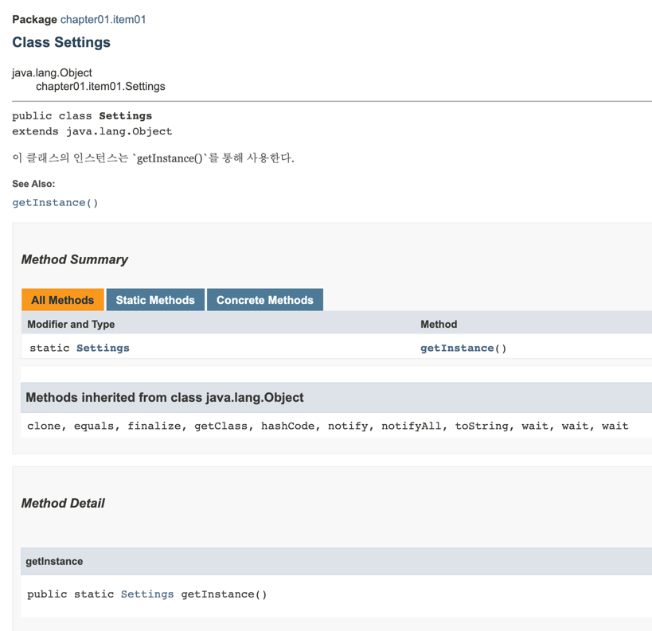

## 생성자 대신 정적 팩토리 메소드를 사용하는 것의 2가지 단점

### 첫 번째, 상속을 하려면 public이나 protected 생성자가 필요하니 정적 팩토리 메소드만 제공하면 하위 클래스를 만들 수 없다.

```java
public class Settings {
    
    private Settings() {}
    
    private static final Settings SETTINGS = new Settings();
    
    public static Settings newInstance() {
        return SETTINGS;
    }
}
```

하지만 꼭 생성자 대신 정적 팩토리 메소드를 사용한다고 해서 생성자를 private하게 설정하는 것은 아니다.
아래와 같이 List의 경우 생성자와 정적 팩토리 메소드 `of`를 동시에 사용할 수 있다.

```java
import java.util.ArrayList;
import java.util.List;

public class Main {

    public static void main(String[] args) {
        List<String> list = new ArrayList<>();
        List<String> list2 = List.of("str1", "str2");
    }
}
```

### 두 번째, 정적 팩토리 메소드는 프로그래머가 찾기 어렵다.

생성자 대신 정적 팩토리 메소드를 사용하게 되면 개발자가 해당 클래스의 인스턴스를 활용하고 싶을 때 곧바로 찾기가 어려울 수 있다.
이러한 이유로 `javadoc`을 활용하여 정확한 문서화를 진행해주는 것이 도움이 된다.

```java
/**
 * 이 클래스의 인스턴스는 getInstance()를 통해 사용한다.
 * @see #getInstance()
 */
public class Settings {

    private boolean useAutoSteering;

    private boolean useABS;

    private Difficulty difficulty;

    private Settings() {}

    private static final Settings SETTINGS = new Settings();

    public static Settings getInstance() {
        return SETTINGS;
    }
}
```

위와 같이 생성자 대신 `getInstance()` 정적 팩토리 메소드를 활용하는 경우 클래스 내 메소드가 많다면 doc에서 곧바로 찾기 쉽지 않다.
이를 해결하기 위해 문서화를 정확하게 진행하자. 위와 같이 주석을 작성하여 javadoc을 생성하면 아래와 같이 `이 클래스가 어떻게 인스턴스를 생성 혹은 활용하는지` 한 눈에 파악할 수 있다.



## 정적 팩토리 메소드 네이밍

생성자를 대신하여 정적 팩토리 메소드를 사용하는 경우 메소드의 네이밍도 굉장히 중요하다.

`from`, `of`, `valueOf`, `getInstance`, `create` 등 정적 팩토리 메소드에 흔히 사용하는 명명 방식이 존재한다.

## 참고
- [YES24 - 이펙티브 자바 Effective Java 3/E](https://www.yes24.com/Product/Goods/65551284)
- [인프런 - 이펙티브 자바 완벽 공략 1부](https://www.inflearn.com/course/%EC%9D%B4%ED%8E%99%ED%8B%B0%EB%B8%8C-%EC%9E%90%EB%B0%94-1#curriculum)
