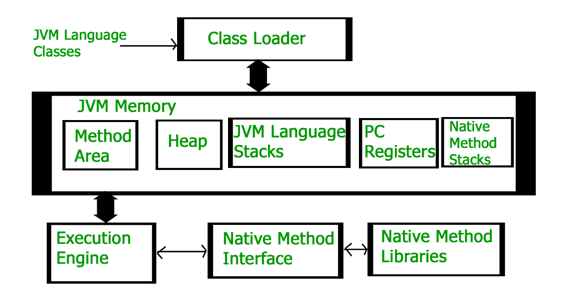

# JVM의 구조

### 참고
- [How JVM Works – JVM Architecture?](https://www.geeksforgeeks.org/jvm-works-jvm-architecture/)

---

JVM은 [JDK, JRE, JVM](../../java/jdk-jre-jvm/content.md)에서 설명했던 것처럼 Java와 같은 JVM 언어를 컴파일하여 생성된 바이트 코드(.class 파일)을 각 OS에 맞게 해석하고 실행하는 역할을 한다.

컴파일된 바이트 코드 즉, 생성된 class 파일을 위의 이미지와 같은 순서로 JVM이 처리하게 된다.

JVM은 다음과 같이 크게 4가지 영역으로 나눠져 있다.

1. 클래스 로더(Class Loader)
2. 메모리(JVM Memory)
3. 실행 엔진(Execution Engine)
4. JNI(Java Native Interface) - 네이티브 메소드 인터페이스, 네이티브 메소드 라이브러리

### 클래스 로더(Class Loader)

클래스 로더는 .class 파일의 바이트 코드를 읽어 메모리(JVM Memory)에 저장하는 역할을 한다.

### 메모리(JVM Memory)

클래스 로더를 통해 다음과 같이 메모리에 바이트 코드의 정보를 저장한다.
- `메소드(Method Area)` 영역에 클래스 수준의 정보를 저장
- `힙(Heap)` 영역에 객체를 저장
