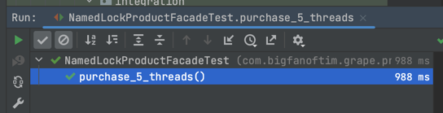

# 네임드 락(Named Lock)의 동시성 제어와 주의할 점

- [비관적 락(Pessimistic Lock)을 적용하여 동시성 제어하기](jpa/concurrency-control/pessimistic-lock/content.md)
- [낙관적 락(Optimistic Lock)에 재시도 전략(RetryStrategy)을 적용하여 동시성 제어하기](jpa/concurrency-control/optimistic-lock/content.md)

---

### 네임드 락이란?

`네임드 락`은 특정 문자열로 잠금을 획득하여 다른 세션에서 잠금을 획득할 수 없게 하여 레코드에 대한 접근을 막는 방식이다. 잠금을 획득한다고 해서 실제 레코드를 잠그는 것은 아니기에 애플리케이션에서 직접 로직으로 잠금 획득과 레코드 접근을 함께 묶어줄 필요가 있다.

### 네임드 락으로 동시성 제어

먼저 잠금을 획득하고, 해제하는 쿼리를 레포지토리에 추가하자.

> 여기서는 잠금을 위한 데이터소스를 실제 애플리케이션을 위해 연결된 데이터소스와 동일하다.
> 데이터소스를 분리하지 않았을 때 어떤 문제가 발생하는지 아래에서 다룰 예정이다.

```java
public interface NamedLockRepository extends JpaRepository<Product, Long> {

    @Query(value = "select get_lock(:key, 3000)", nativeQuery = true)
    void getLock(@Param("key") String key);

    @Query(value = "select release_lock(:key)", nativeQuery = true)
    void releaseLock(@Param("key") String key);
}
```

그리고 조회와 재고 감소(구매) 로직을 담고 있는 서비스 레이어를 추가한다. 네임드 락과 관련된 복잡한 구성은 Facade 레이어로 분리할 것이다.

```java
@RequiredArgsConstructor
@Service
public class ProductService {

    private final ProductRepository productRepository;

    @Transactional(propagation = Propagation.REQUIRES_NEW)
    public void purchase(Long productId, Long quantity) {
        Product product = productRepository.findById(productId).orElseThrow();
        product.purchase(quantity);
    }
}
```

아래와 같이 네임드 락과 관련된 로직을 담은 Facade 레이어를 추가한다.

```java
@RequiredArgsConstructor
@Component
public class NamedLockProductFacade {

    private final ProductService productService;
    private final NamedLockRepository namedLockRepository;

    @Transactional
    public void purchase(Long productId, Long quantity) {
        String keyForProductNamedLock = getKeyForProductNamedLock(productId);

        try {
            namedLockRepository.getLock(keyForProductNamedLock);
            productService.purchase(productId, quantity);
        } finally {
            namedLockRepository.releaseLock(keyForProductNamedLock);
        }
    }

    private static String getKeyForProductNamedLock(Long productId) {
        return "product_id_" + productId.toString();
    }
}
```

위에서 언급했던 것처럼 SQL로 `GET_LOCK` 명령을 실행한다고 해서 실제로 변경하고자 하는 레코드에 대한 잠금을 획득하는 것은 아니다. 따라서 문자열에 해당하는 락을 획득한 경우에만 해당 레코드에 접근 가능한 구조로 설계해야 한다.

1. 스레드1~ 스레드10에서 동시에 같은 문자열인 `product_id_1`로 잠금 요청
2. 스레드8이 잠금 획득, 나머지 9개의 스레드는 그대로 대기 상태
3. 스레드8이 재고 감소(구매) 로직 실행
4. 스레드8이 `produt_id_1`로 획득한 잠금을 해제
5. 다른 스레드가 잠금 획득
6. 반복

### 테스트

```java
@SpringBootTest
class NamedLockProductFacadeTest {

    @Autowired
    ProductRepository productRepository;

    @Autowired
    NamedLockProductFacade namedLockProductFacade;

    @AfterEach
    public void tearDown() {
        productRepository.deleteAll();
    }

    @Test
    public void purchase_5_threads() throws Exception {
        Product product = Product.builder().quantity(100L).build();
        productRepository.save(product);

        int threadCount = 5;
        ExecutorService executorService = Executors.newFixedThreadPool(20);
        CountDownLatch countDownLatch = new CountDownLatch(threadCount);
        for (int i = 0; i < threadCount; i++) {
            executorService.submit(() -> {
                try {
                    namedLockProductFacade.purchase(product.getId(), 1L);
                } finally {
                    countDownLatch.countDown();
                }
            });
        }
        countDownLatch.await();

        Product findProduct = productRepository.findById(product.getId()).orElseThrow();
        Assertions.assertThat(findProduct.getQuantity()).isEqualTo(95L);
    }
}
```

5개의 스레드가 동시에 재고 감소(구매) 로직을 실행했을 때 의도한대로 5개의 재고가 잘 차감된 것을 확인할 수 있다.



### 네임드 락 사용 시 주의해야 할 점

위에서 설명한 네임드 락의 실행 순서를 다시 살펴보자.

1. 스레드1~ 스레드10에서 동시에 같은 문자열인 `product_id_1`로 잠금 요청
2. 스레드8이 잠금 획득, 나머지 9개의 스레드는 그대로 대기 상태
3. 스레드8이 재고 감소(구매) 로직 실행
4. 스레드8이 `produt_id_1`로 획득한 잠금을 해제
5. 다른 스레드가 잠금 획득
6. 반복

여기서 `2번`을 잘보면 10개의 스레드가 동시에 같은 문자열로 잠금을 요청하는 경우 잠금을 획득하지 못한 9개의 스레드는 대기 상태로 들어간다.

이렇게 잠금 대기 상태로 들어가게 되면 데이터베이스 커넥션 풀에서 그대로 연결을 유지한 상태로 대기하게 된다. 

따라서 해당 데이터소스에 대한 커넥션 풀이 모자르게 되면 문제가 발생할 수 밖에 없다. 이때 잠금을 위한 데이터소스와 실제 애플리케이션에서 사용하는 데이터소스를 분리하지 않았다면 DB와 상호작용하는 모든 기능에 영향을 주게 된다.

이를 해결하기 위해서는 가급적 잠금을 위한 데이터소스를 분리하는 편이 좋고, 분리한 데이터소스 또한 적당한 풀 사이즈를 유지해주는 것이 좋다.

### 비관적 락은?

비관적 락의 경우에는 네임드 락과는 달리 연결 상태를 유지하는 것이 아니라 데이터베이스가 직접 락을 관리하므로 풀 사이즈를 초과하는 문제가 발생하지 않는다.
