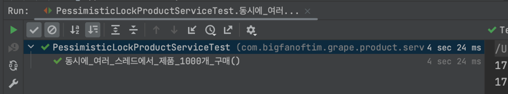

# 비관적 락(Pessimistic Lock)을 적용하여 동시성 제어하기

### 읽기 전에 미리 알면 좋은 내용들
- [MySQL 엔진의 잠금](database%2Fmysql%2Fmysql-engine-lock%2Fcontent.md)
- [InnoDB 스토리지 엔진 잠금](database%2Fmysql%2Finnodb-storage-engine-lock%2Fcontent.md)
- [InnoDB 인덱스와 잠금](database%2Fmysql%2Finnodb-index-lock%2Fcontent.md)
- [트랜잭션 격리 수준](database%2Fmysql%2Ftransaction-isolation-level%2Fcontent.md)

---

비관적 락(Pessismistic Lock)은 동시성 제어를 위한 전략 중 하나로 특정 데이터에 대한 동시 접근을 막기 위해 데이터를 직접 잠그는 방식이다.

SQL에서는 다음과 같이 `FOR UPDATE` 절을 쿼리에 추가해 사용한다.

```sql
BEGIN;
SELECT * FROM employees WHERE employee_id = 1 FOR UPDATE;
-- 해당 레코드에 락이 걸린 상태

UPDATE employees SET salary = salary + 1000 WHERE employee_id = 1;
COMMIT; -- 락이 해제되고 변경 반영
```

이렇게 특정 트랜잭션에서 레코드를 잠금으로써 다른 트랜잭션에서의 작업을 막기 때문에 데이터의 일관성 유지가 용이하다는 장점이 있다.

하지만 락이 걸린 상태에서 다른 트랜잭션에서 해당 레코드에 대한 작업이 대기 상태가 되므로, 자칫하면 성능에 문제가 생길 수 있다.

또한 트랜잭션 A, B에서 동시에 서로 잠금해놓은 레코드에 접근하게 되는 경우 두 트랜잭션 모두 대기 상태에 빠지는 데드락 현상이 발생할 수 있으므로 조심해야 한다.

### JPA에서 비관적 락을 다루는 방법

우선 동시성 제어를 테스트하기 위한 Product 엔티티를 만들자. 멀티스레드 환경에서 제품의 재고를 동시에 차감시키며 비관적 락이 잘 동작하는지 볼 것이다.

재고를 차감시킬 수 있는 간단한 `purchase` 메소드를 함께 구현해놓자.

```java
@Getter
@NoArgsConstructor(access = AccessLevel.PROTECTED)
@Table(name = "products")
@Entity
public class Product {

    @Id
    @GeneratedValue(strategy = GenerationType.IDENTITY)
    private Long id;

    private Long quantity;

    @Builder
    public Product(Long id, Long quantity) {
        this.id = id;
        this.quantity = quantity;
    }

    public void purchase(Long quantity) {
        if (this.quantity - quantity < 0) {
            throw new RuntimeException("상품 수량을 0 미만으로 감소시킬 수 없음");
        }

        this.quantity -= quantity;
    }
}
```

그리고 Product에 매핑되는 레포지토리를 다음과 같이 만들자.

```java
public interface ProductRepository extends JpaRepository<Product, Long> {

    @Lock(LockModeType.PESSIMISTIC_WRITE)
    @Query("select p from Product p where p.id = :id")
    Optional<Product> findByIdWithPessimisticLock(@Param("id") Long id);
}
```

JPA에서는 `@Lock` 어노테이션을 활용하여 해당 쿼리에 적절한 잠금 모드를 설정할 수 있는데, 위와 같이 작성하게 되면 위에서 언급했던 것처럼 `FOR UPDATE` 절을 JPQL에 추가하여 적절한 SQL을 만들게 된다.

아마 테스트를 해보면 알겠지만 만약 ID 10번인 Product를 조회하게 되면 다음과 같은 SQL문이 실행될 것이다. (MySQL)

```mysql
SELECT p.* FROM products p WHERE p.id = 10 FOR UPDATE;
```

그럼 이제 Service 계층을 간단하게 구현하고 테스트 코드를 작성해보자.

```java
@RequiredArgsConstructor
@Service
public class PessimisticLockProductService {

    private final ProductRepository productRepository;

    @Transactional
    public void purchase(Long productId, Long quantity) {
        Product product = productRepository.findByIdWithPessimisticLock(productId).orElseThrow();
        product.purchase(quantity);
    }
}
```

```java
@SpringBootTest
class PessimisticLockProductServiceTest {

    @Autowired
    private PessimisticLockProductService pessimisticLockProductService;

    @Autowired
    private ProductRepository productRepository;

    @AfterEach
    public void tearDown() {
        productRepository.deleteAll();
    }

    @Test
    public void 동시에_여러_스레드에서_제품_1000개_구매() throws Exception {
        // 재고 1000개의 제품 생성
        Product product = Product.builder()
                .id(1L)
                .quantity(1000L)
                .build();
        productRepository.save(product);

        // 총 100개의 스레드에서 제품 구매(재고 차감) 로직 실행
        int threadCount = 1000;
        
        // 동시에 실행될 스레의 수를 50개로 제한하는 스레드풀 생성
        ExecutorService executorService = Executors.newFixedThreadPool(50);
        
        // 동시 실행 제어를 위한 래치 생성
        CountDownLatch countDownLatch = new CountDownLatch(threadCount);

        /**
         * 총 100번의 메소드 호출
         * 스레드의 작업이 완료되면 카운트 1씩 감소
         */
        for (int i = 0; i < threadCount; i++) {
            executorService.submit(() -> {
                try {
                    pessimisticLockProductService.purchase(1L, 1L);
                } finally {
                    countDownLatch.countDown();
                }
            });
        }

        // count 0이 될 때까지 대기
        countDownLatch.await();

        Product findProduct = productRepository.findById(1L).orElseThrow();
        assertThat(findProduct.getQuantity()).isEqualTo(0);
    }
}
```

테스트를 실행해보면 다음과 같이 잘 동작하는 것을 볼 수 있다.



만약 아무런 잠금을 설정하지 않고 여러 스레드에서 하나의 레코드를 수정하려고 동시에 접근하게 되는 경우 1000개의 재고가 모두 차감되어 0이 되는 것이 아니라 100개 혹은 200개씩 재고가 남아있을 것이다.
