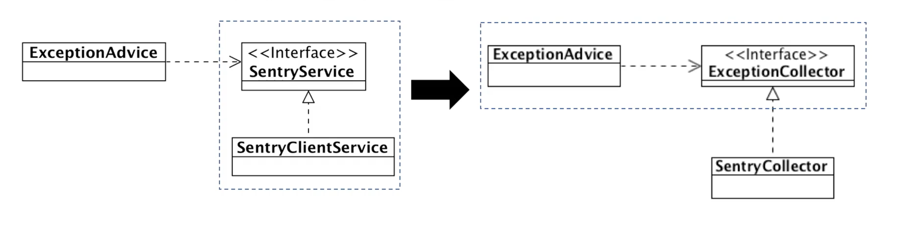

# 의존 역전 원칙 - DIP (Dependency Inversion Principle)

## 참고
> [인프런 객체 지향 프로그래밍 입문](https://www.inflearn.com/course/%EA%B0%9D%EC%B2%B4-%EC%A7%80%ED%96%A5-%ED%94%84%EB%A1%9C%EA%B7%B8%EB%9E%98%EB%B0%8D-%EC%9E%85%EB%AC%B8/dashboard) - 최범균
> 
---

- 의존 역전 원칙
    - 고수준 모듈이 저수준 모듈의 구현에 의존하면 안된다.
    - 저수준 모듈이 고수준 모듈에서 정의한 추상타입에 의존해야 한다.

풀어 설명하면 고수준 모듈이 저수준 모듈의 구현에 의존하는 상황에서 발생하는 문제를 해결하기 위해 등장한 것이 DIP이다.

예를 한번 살펴보자.

```Java
/**
 * 고수준 모듈에서 사용중인 저수준 모듈 변경 전
 */
public class MeasureService {
    public void measure(MeasureReq req) {
        File file = req.getFile();
        nasStorage.save(file);

        jdbcTemplate.update("insert into MEAS_INFO ...");
        
        jdbcTemplate.update("insert into BP_MOD_REQ ...");
    }
}

/** 
 * 고수준 모듈에서 사용중인 저수준 모듈 변경 후
 */
public class MeasureService {
    public void measure(MeasureReq req) {
        File file = req.getFile();
        s3Storage.update(file);

        jdbcTemplate.update("insert into MEAS_INFO ...");

        rabitmq.convertAndSend(...);
    }
}
```

고수준 모듈(MeasureService)의 정책은 변경된게 없으나 저수준 모듈 구현의 변경으로 고수준 모듈의 코드까지 변경되어야 하는 상황이다. 

## 고수준 모듈의 추상화에 저수준 모듈의 의존해야 한다.

이런 문제를 해결하기 위해 저수준 모듈이 고수준 모듈의 추상화에 의존할 수 있도록 구현하는 것이 `의존 역전 원칙`이다.

이때 명심해야 할 것은 `저수준 모듈 구현 입장에서 추상화`하는 것이 아니라 `고수준 모듈의 정책 입장에서 추상화`하는 것이다.



위의 이미지 좌측은 SentryClientService라는 저수준 모듈의 구현을 추상화하여 SentryService 인터페이스를 생성했고, 우측은 고수준 모듈의 정책의 입장에서 추상화하여 ExceptionCollector 인터페이스를 생성했다.

좌측과 같이 저수준 모듈의 구현을 추상화하는 식으로 진행하게 되면 Sentry가 아니라 ElasticSearch와 같은 다른 서비스로 교체하고 싶은 경우 문제가 발생할 수 있다.

하지만 우측과 같이 고수준 모듈 정책 입장에서 추상화한 ExceptionCollector 인터페이스를 생성한 상황이라면 SentryCollector 대신 언제든지 ElasticSearchCollector와 같은 또 다른 저수준 모듈의 구현체를 갈아끼움으로써 유연하게 대처가 가능해진다.

## 추상화에 부단한 노력이 필요하다.

- 처음부터 바로 좋은 설계가 나오긴 힘들다.
- 요구사항/업무 이해도가 높아지면서 저수준 모듈을 인지하고 상위 관점에서 저수준 모듈에 대한 추상화를 시도해야 한다.

예를 들어 다음과 같이 우리의 이해도에 따라 추상화를 진행할 수 있다.

1. Exception이 발생 -> Sentry에 Exception 정보 보낸다. (아직 추상화하기 부족)
2. Exception이 발생 -> Sentry에 Exception 정보 모은다. (모은다는 하위 기능 도출)
3. Exception이 발생 -> Collector에 Exception을 모은다. (ExceptionCollector라는 상위 모듈 정책 입장에서의 추상화)