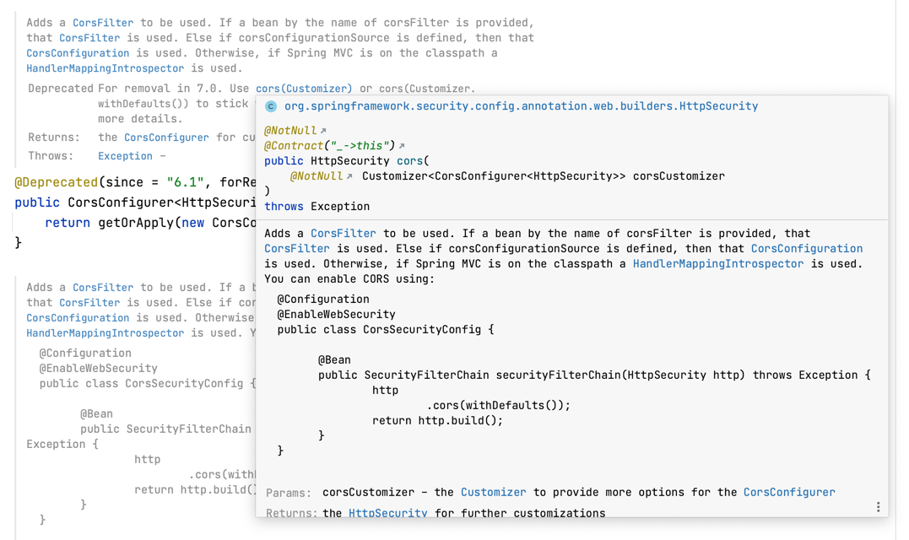

# WebSecurityConfigurerAdapter가 아닌 component-based security configuration

> In Spring Security 5.7.0-M2 we deprecated the WebSecurityConfigurerAdapter, as we encourage users to move towards a component-based security configuration.

Spring Security 5.7.0-M2 버전부터 WebSecurityConfigurerAdapter 구현 방식이 deprecated 되면서 컴포넌트 기반의 설정을 지원하기 시작했다.

## 차이점

```Java
/**
 * WebSecurityConfigurerAdapter security configuration
 */
@RequiredArgsConstructor
@EnableWebSecurity
public class SecurityConfig extends WebSecurityConfigurerAdapter {

    private final CustomOauth2UserService customOauth2UserService;

    @Override
    protected void configure(HttpSecurity http) throws Exception {
        http
                .csrf().disable()
                .headers().frameOptions().disable()
                .and()
                    .authorizeRequests()
                    .antMatchers("/"").permitAll()
                    .antMatchers("/api/v1/**").authenticated())
                .and()
                    .oauth2Login()
                        .userInfoEndpoint()
                            .userService(customOauth2UserService);
    }
}
```

기존에는 위와 같이 WebSecurityConfigurerAdapter를 상속받아 구현했다면, 이제는 `filterChain`을 `Bean`에 직접 등록하는 방식으로 개발할 수 있다.

```Java
/**
 * component-based security configuration
 */
@RequiredArgsConstructor
@EnableWebSecurity
@Configuration
public class SecurityConfig {

    private final JwtAuthenticationFilter jwtAuthenticationFilter;

    @Bean
    public SecurityFilterChain filterChain(HttpSecurity http) throws Exception {
        http
                .cors(Customizer.withDefaults())
                .csrf((csrf) -> csrf.disable())
                .httpBasic((httpBasic) -> httpBasic.disable())
                .sessionManagement((sessionManagement) ->
                        sessionManagement
                                .sessionCreationPolicy(SessionCreationPolicy.STATELESS))
                .authorizeHttpRequests((authorizedHttpRequests) ->
                        authorizedHttpRequests
                                .requestMatchers("/").permitAll()
                                .requestMatchers("/api/v1/**").authenticated()
                .exceptionHandling((exceptionHandling) ->
                        exceptionHandling
                                .authenticationEntryPoint(new HttpStatusEntryPoint(HttpStatus.UNAUTHORIZED)));

        return http.build();
    }
}
```

어댑터를 상속받아 구현하는 방식이 deprecate됨에 따라 기존에 사용하던 메소드도 대부분 함께 deprecate되었다.

따라서 `filterChain`으로 구현하는 경우 메소드 사용 방식이 조금 달라졌으니 공식 문서 혹은 소스코드 주석을 참고하여 수정해주자.



또한 이제 더 이상 어댑터를 상속받아서 구현한 것이 아닌, 새로운 설정 클래스를 만든 것이기 때문에 `@Configuration` 어노테이션을 매핑해줘야 한다.